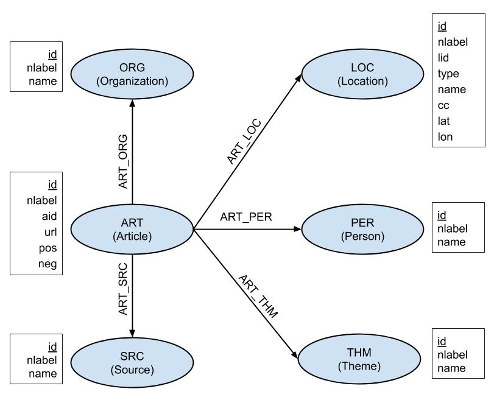

# GDELT Articles Graph

## Overview

This page provides instructions and source code for producing a Heterogeneous Information Network of news articles and associated information about mentioned organizations and persons from data obtained from the [GDELT](https://www.gdeltproject.org/) project.

## Instructions

To download data from GDELT, run the bash script `fetch_data.sh`, with argument the desired date with no dashes. For example, to download the data from 1st April, 2019, run the command `./fetch_data.sh 20190401`. This will download all .zip files from this day, unzip them and combine them in one big file, named `20190401_raw.txt`.

To import the data into a [NetworkX](https://networkx.github.io/) graph, run the `extract_data.py` with the same argument. For example, to import the data from 1st April, 2019, run the command `python extract_data.py 20190401`. This will create two files, a filtered version of the previous raw file named `20190401_filtered.csv` and a gpickle for the Networkx graph named `20190401_gpickle.gpickle`.

## Data description

The figure below depicts the schema of the produced graph.

The following table shows the number of graph nodes and edges for each type, based on the data of 1st April, 2019:

| Node | Number |
| --- | --- |
| Article | 215,739 |
| Person | 189,833 |
| Organization | 119,588 |
| Theme | 10,690 |
| Location | 31,267 |
| Source | 13,091 |
| **Total** | **580,208** |

| Edge | Number |
| --- | --- |
| ART_PER | 732,334 |
| ART_ORG | 543,441 |
| ART_THM | 5,140,224 |
| ART_LOC | 658,494 |
| ART_SRC | 223,668 |
| **Total** | **7,298,161** |

Each filtered .csv file has no header, since the user might want to concatenate the files. The columns of the files are:

1. aid: Article Id, unique for each article.
2. url: Original url of article.
3. pos: Positive Score of article.
4. neg: Negative Score of article.
5. organizations: List of organizations mentioned in the article. The list is concatenated by the separator `;` and each organization is mentioned by name.
6. persons: List of persons mentioned in the article. The list is concatenated by the separator `;` and each person is mentioned by name.
7. sources: List of sources mentioned in the article. The list is concatenated by the separator `;` and each source is mentioned by name.
8. themes: List of themes mentioned in the article. The list is concatenated by the separator `;` and each theme is mentioned by name.
9. locations: List of locations mentioned in the article. The list is concatenated by the separator `;` and each location is characterized by the following fields:
   - lid: Location Id, unique for each location.
   - type: type of location, numeric.
   - name: The full name of the location.
   - cc: Country Code of the location.
   - lat: Latitude of the location.
   - long: Longitude of the location.

More information about the GDELT data can be found [here](http://data.gdeltproject.org/documentation/GDELT-Global_Knowledge_Graph_Codebook-V2.1.pdf).
